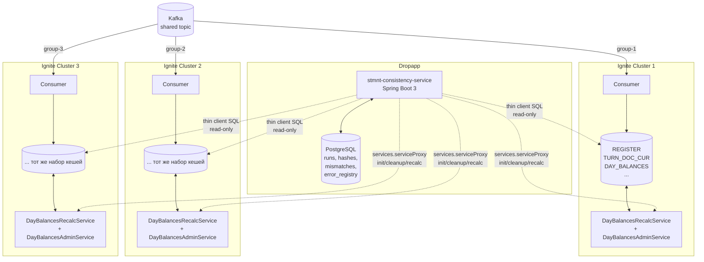
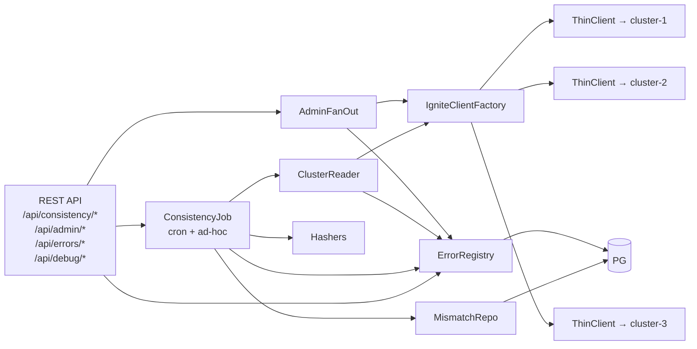
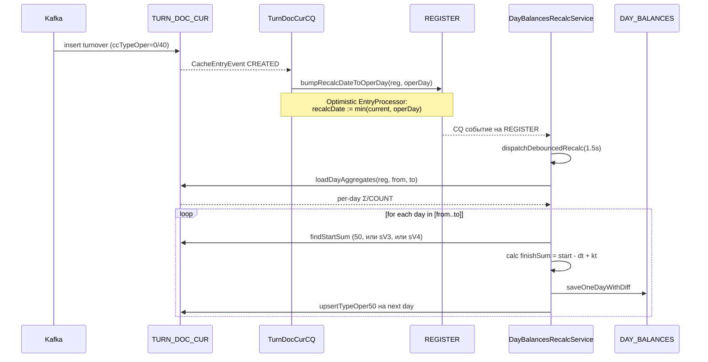
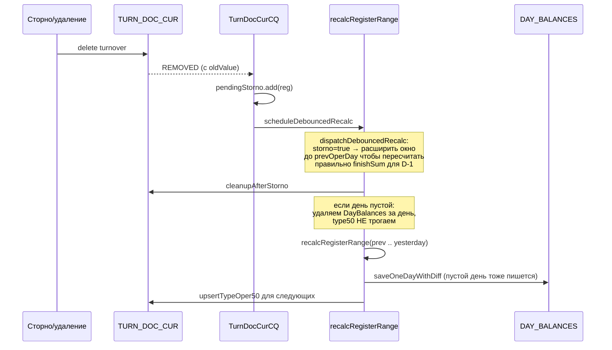
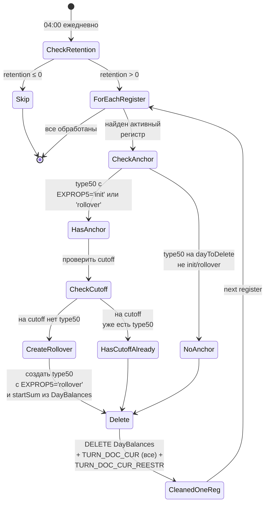
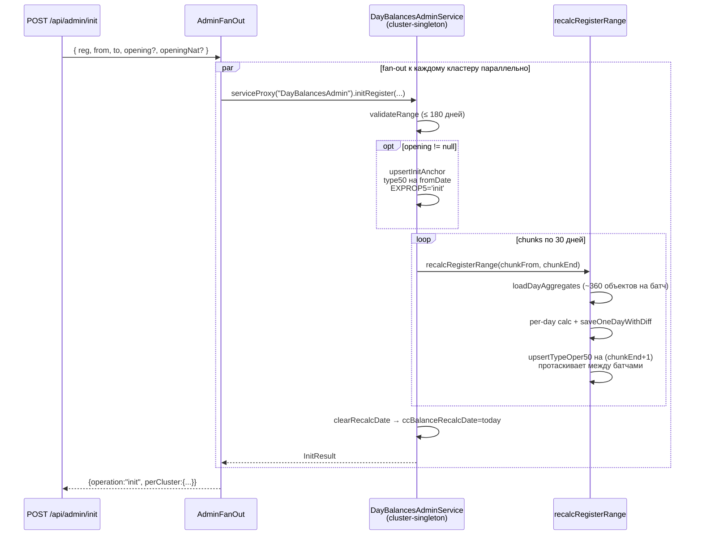
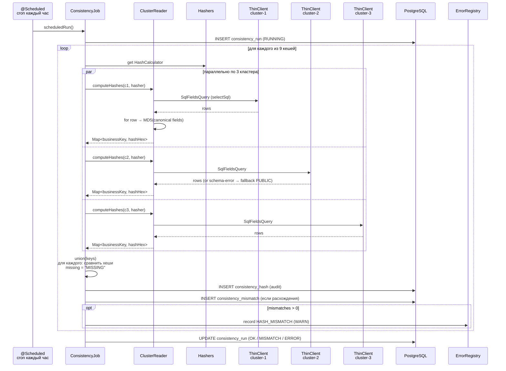

# stmnt-consistency — отчёт по архитектуре, расчёту остатков и сверке кластеров

Дата: 2026-05-25
Состав: stmnt-ignite_precalc (Ignite-side) + stmnt-consistency (Dropapp-side) + docker-compose стенд (3 Apache Ignite 2.16 + Postgres 16 + Spring Boot 3 service).

---

## Содержание

1. [Контекст и цели](#контекст-и-цели)
2. [Архитектура](#архитектура)
3. [Расчёт остатков (DayBalances)](#расчёт-остатков-daybalances)
4. [Daily cleanup с forward-миграцией якоря](#daily-cleanup-с-forward-миграцией-якоря)
5. [Init-режим и bootstrap](#init-режим-и-bootstrap)
6. [Hash-сверка и Error Registry](#hash-сверка-и-error-registry)
7. [Test scenarios: воспроизведённые расхождения](#test-scenarios-воспроизведённые-расхождения)
8. [REST API](#rest-api)
9. [Запуск стенда](#запуск-стенда)

---

## Контекст и цели

- 3 независимых Ignite-кластера читают один общий Kafka-топик (разные `group.id`) → строят идентичные данные.
- Между кластерами **репликации нет** — согласованность достигается за счёт идемпотентного процессинга одного и того же потока событий.
- Нужно: **обнаруживать дрейф** между кластерами (баги в логике, нарушения консистентности, потеря событий), плюс админ-операции **массового пересчёта** регистров.

---

## Архитектура

### Общая схема



**Ключевые свойства:**
- Dropapp **не имеет прямого соединения** с кластерами, кроме thin-client'а.
- Ignite-кластера не общаются между собой.
- Все операции (read для hash + write для init/cleanup/recalc) — через стандартный thin-client API.

### Компоненты Dropapp-сервиса



---

## Расчёт остатков (DayBalances)

Описание для контекста — сама логика живёт в `stmnt-ignite_precalc`, в `DayBalancesRecalcService`.

### Объекты, участвующие в расчёте

| Кеш | Роль |
|---|---|
| `TURN_DOC_CUR` | Все обороты по регистру. `ccTypeOper`: 0/40 — обычные, **50 — служебный «полтинник»** (начальный остаток дня). |
| `DAY_BALANCES` | Производный кеш: `startSum / dtSum / ktSum / finishSum` за каждый день. |
| `REGISTER` | Сам регистр: `ccBalanceRecalcDate`, `ccReestrRecalcDate`, currency и т.д. |
| `CB_RATE` | Курсы ЦБ для пересчёта в нацвалюту. |

### Жизненный цикл одного дня



**Защитные механизмы:**
- **Дебаунс 1.5 сек** — много вставок за короткий промежуток группируются в один пересчёт.
- **OptimisticEntryProcessor** на регистре — гарантирует atomic update `recalcDate`.
- **Calcite engine hints** на критичных запросах (`ORDER BY ... DESC LIMIT 1`) — reverse index scan вместо full sort.

### Сторно/удаление



---

## Daily cleanup с forward-миграцией якоря

**Проблема:** при retention=180 дней каждый день надо удалять данные за день 181. Но если на этом дне был **init-якорь** (type50 с `EXPROP5='init'`), его прямое удаление **разорвёт цепочку остатков** — последующие пересчёты не найдут точку рестарта.

**Решение:** перед удалением forward-мигрировать якорь на новый край retention.

### Алгоритм



### Пример работы для retention=90

День сегодня 2026-05-25:
- `dayToDelete = 2026-02-23` (today - 91)
- `cutoff = 2026-02-24` (today - 90, новый край retention)

Если регистр R001 имеет init-якорь от 2026-02-23 со `startSum=10 000`:
1. Forward-миграция: создаём type50 на 2026-02-24 с `startSum=10 200` (взято из `DayBalances` за 2026-02-23 `.ccFinishSum`), помечаем `EXPROP5='rollover'`.
2. Удаляем за 2026-02-23: `DayBalances` + все `TURN_DOC_CUR` (включая старый init-якорь) + `TURN_DOC_CUR_REESTR`.

Следующий день retention сдвинется ещё на 1 — мигрированный rollover-якорь сам станет источником для следующей миграции.

---

## Init-режим и bootstrap

`initRegister(reg, fromDate, toDate, openingBalance?, openingBalanceNat?)` — массовый пересчёт **до 180 дней** с опциональным стартовым остатком.

### Алгоритм



**Память:** O(30 дней агрегатов) = ~360 объектов в Map за раз, независимо от длины диапазона. Init-якорь живёт в существующем `TURN_DOC_CUR` (1 строка) — никаких новых кешей.

**Защита якорей:**
- `upsertTypeOper50` пропускает запись, если на дне уже есть type50 с `EXPROP5='init'`.
- `cleanupBalances` НЕ удаляет type50 с `EXPROP5='init'`.
- `dailyCleanupOnce` — forward-мигрирует, прежде чем удалить.

---

## Hash-сверка и Error Registry

### Поток обнаружения расхождений



### Error Registry

Единая таблица для всех ошибок:

```sql
CREATE TABLE consistency_error (
    id BIGSERIAL PRIMARY KEY,
    occurred_at TIMESTAMPTZ NOT NULL DEFAULT now(),
    source VARCHAR(32) NOT NULL,        -- consistency_job | cluster_reader | admin_fanout | debug_seed | db | scheduler
    level VARCHAR(16) NOT NULL,         -- ERROR | WARN | INFO
    code VARCHAR(64),                    -- CLUSTER_DOWN, QUERY_FAILED, HASH_MISMATCH, INIT_FAILED, ...
    message TEXT NOT NULL,
    details_json JSONB,                  -- произвольный контекст
    related_run_id BIGINT,
    cluster_id VARCHAR(32),
    cache_name VARCHAR(64),
    resolved_at TIMESTAMPTZ,
    resolution_notes TEXT
);
```

**Точки сбора:** все `catch` в `ConsistencyJob`, `ClusterReader`, `AdminFanOut`, `DebugSeedController` → `ErrorRegistry.record(...)` или `.error(...)`.

Принципы:
- **Append-only**, никогда не теряет события (даже если PG падает — fallback на slf4j).
- Уровень `WARN` для бизнес-проблем (HASH_MISMATCH, CLUSTER_DOWN), `ERROR` для технических (QUERY_FAILED, исключения).
- Резолюция: `POST /api/errors/{id}/resolve` с `notes`.

---

## Test scenarios: воспроизведённые расхождения

Все 9 сценариев выполнены на работающем стенде (см. ниже **Запуск стенда** для команд воспроизведения). Каждый сценарий перед применением сбрасывает baseline.

| Сценарий | Что меняем | Run ID | Status | Mismatch найден | Где |
|---|---|---|---|---|---|
| `baseline` | — (3 кластера идентичны) | 10 | OK | нет (новых) | — |
| `currency` | `REGISTER.CURRENCY` R001: RUB→EUR на cluster-1 | 11 | **MISMATCH** | id=3 | REGISTER:R001 |
| `scale` | `DAY_BALANCES.CCDTSUM`: 200.0 vs 200.000000 | 12 | **OK** ✅ | нет | scale нормализован до 6 знаков |
| `tolerance` | `DAY_BALANCES.CCFINISHSUM`: 24300.004 vs 24300.003 | 13 | **OK** ✅ | нет | 0.001 в пределах 0.01 tolerance |
| `tolerance_break` | `DAY_BALANCES.CCFINISHSUM`: 24300.06 vs 24300.00 | 14 | **MISMATCH** | id=4 | DAY_BALANCES:R001:2026-05-24 |
| `missing` | `DELETE FROM REGISTER WHERE OBJECTID='R002'` на cluster-2 | 15 | **MISMATCH** | id=5 | REGISTER:R002 cluster-2:`MISSING` |
| `extra` | `INSERT R999` только на cluster-3 | 16 | **MISMATCH** | id=6 | REGISTER:R999 cluster-1/2:`MISSING` |
| `client_inn` | `CLIENT.CCINN` C001 на cluster-3 | 17 | **MISMATCH** | id=7 | CLIENT:C001 cluster-3 hash отличается |
| `cbrate` | `CB_RATE.CCRATE` USD на cluster-2: 90.50→91.99 | 18 | **MISMATCH** | id=8 | CB_RATE:USD_20260524 cluster-2 hash отличается |

### Особенности нормализации (что хеш одинаков даже при «визуальной» разнице)

| Случай | Демонстрация | Поведение |
|---|---|---|
| BigDecimal scale | `200.0`, `200.000`, `200.000000` | Одинаковый хеш — `HashUtil.stringify` приводит к `setScale(6, HALF_UP)` |
| Timestamp/Date | UTC epoch millis | Одинаковый хеш независимо от текстового представления |
| `null` | NULL в БД | Подставляется `"NULL"`-маркер, чтобы не было amphigorism |
| DAY_BALANCES tolerance | разница ≤ 0.01 | Округление до 2 знаков **перед** MD5 |

### Демонстрация `MISSING` (сценарий `missing`)

API-ответ из `/api/consistency/mismatches?unresolvedOnly=true`:
```json
{
  "id": 5,
  "runId": 15,
  "cacheName": "REGISTER",
  "businessKey": "R002",
  "clusterHashes": {
    "cluster-1": "16d4946c6855cb510da3fbf7abcb4e1f",
    "cluster-2": "MISSING",
    "cluster-3": "16d4946c6855cb510da3fbf7abcb4e1f"
  }
}
```

### Состояние Error Registry после прогона всех сценариев

```bash
$ curl http://localhost:8080/api/errors/stats
{
  "by_source": [
    {"value":"cluster_reader",   "count":108},
    {"value":"consistency_job",  "count":6}
  ],
  "by_code": [
    {"value":"QUERY_FAILED",     "count":108},
    {"value":"HASH_MISMATCH",    "count":6}
  ],
  "by_level": [
    {"value":"ERROR",            "count":108},
    {"value":"WARN",             "count":6}
  ]
}
```

`QUERY_FAILED ×108` — ожидаемые ошибки для тех кешей, которые в smoke не засеяны (`TURN_DOC_CUR`, `INCOME_SALDO`, `DIVISION`, `CASH_SYMBOL_DOC`) × 3 кластера × 9 прогонов ≈ 108. В реальном кластере с полным набором кешей этих ошибок не будет.

---

## REST API

### Consistency

| | URL | Назначение |
|---|---|---|
| `POST` | `/api/consistency/run` | Ad-hoc прогон (body: `{cacheName?}`) |
| `GET`  | `/api/consistency/runs?limit=&status=` | История |
| `GET`  | `/api/consistency/runs/{id}` | Детали |
| `GET`  | `/api/consistency/mismatches?cacheName=&since=&unresolvedOnly=&limit=` | Расхождения |
| `POST` | `/api/consistency/mismatches/{id}/resolve` | Разрешить |

### Admin (fan-out на все 3 кластера)

| | URL | Назначение |
|---|---|---|
| `POST` | `/api/admin/init` | Init-режим (до 180 дней) с opt. opening balance |
| `POST` | `/api/admin/cleanup` | Cleanup `< beforeDate` |
| `POST` | `/api/admin/recalc` | Обычный recalc-range |

### Error Registry

| | URL | Назначение |
|---|---|---|
| `GET`  | `/api/errors?source=&level=&code=&clusterId=&cacheName=&since=&unresolvedOnly=&limit=` | Список |
| `GET`  | `/api/errors/stats?since=` | Сводка по source/level/code |
| `POST` | `/api/errors/{id}/resolve` | Разрешить с `notes` |

### Debug (smoke)

| | URL | Назначение |
|---|---|---|
| `POST` | `/api/debug/seed` | Identical seed во все 3 (опц. `{divergeCluster}`) |
| `POST` | `/api/debug/scenario/{name}` | Один из 8 named-сценариев (см. выше) |
| `POST` | `/api/debug/reset` | DELETE всех таблиц на всех кластерах |

---

## Запуск стенда

### Сборка и старт

```bash
cd C:/Users/rusgr/Downloads/stmnt-consistency

# Build (требуется JDK 17 + Maven; deps только из public Maven Central)
mvn -pl stmnt-consistency-service -am package -DskipTests

# Up (3 Apache Ignite 2.16 + Postgres 16 + service)
docker compose up -d

# Wait for service
until curl -sf http://localhost:8080/actuator/health; do sleep 2; done
```

### Smoke-сценарий «все хорошо → расхождение»

```bash
# 1. Identical seed
curl -X POST http://localhost:8080/api/debug/seed -H 'Content-Type: application/json' -d '{}'

# 2. Run → OK
curl -X POST http://localhost:8080/api/consistency/run

# 3. Воспроизвести расхождение валюты
curl -X POST http://localhost:8080/api/debug/scenario/currency

# 4. Run → MISMATCH
curl -X POST http://localhost:8080/api/consistency/run

# 5. Посмотреть расхождения
curl 'http://localhost:8080/api/consistency/mismatches?unresolvedOnly=true'

# 6. Посмотреть Error Registry
curl 'http://localhost:8080/api/errors/stats'

# 7. Разрешить отдельную ошибку
curl -X POST http://localhost:8080/api/errors/1/resolve \
     -H 'Content-Type: application/json' \
     -d '{"notes":"investigated in JIRA-XYZ"}'
```

### Прогон всех 8 named-сценариев

```bash
for s in baseline currency scale tolerance tolerance_break missing extra client_inn cbrate; do
  if [ "$s" = "baseline" ]; then
    curl -sS -X POST http://localhost:8080/api/debug/seed -d '{}'
  else
    curl -sS -X POST http://localhost:8080/api/debug/scenario/$s
  fi
  echo "=== $s ==="
  curl -sS -X POST http://localhost:8080/api/consistency/run
done
```

### Daily cleanup (только в реальном stmnt-ignite_precalc, не в vanilla стенде)

В **JVM-аргументы** Ignite-кластера:
```
-Ddaybalances.cleanup.retention-days=180
```

После этого:
- Каждый день в **04:00** автоматический cleanup: удаляется 1 день (`today - 181`), якоря forward-мигрируются на `today - 180`.
- Вручную через REST: `POST /api/admin/recalc` → `DayBalancesAdminService.dailyCleanupNow()`.

---

## Что НЕ задеплоено в smoke-стенде

- `DayBalancesAdminService` (Ignite cluster-singleton service) написан, скомпилирован, готов к деплою, но не задеплоен в vanilla `apacheignite/ignite:2.16.0`-контейнерах. Для использования endpoint'ов `/api/admin/*` нужно собрать кастомный Ignite-image с JAR'ом из `stmnt-ignite_precalc/stmnt-ignite-lib`, что требует доступа к корпоративному Nexus (`com.sbt.ignite:*`).
- `EnrichDirectory` hasher — пропущен по спецификации, нужно сначала добавить `CCVERSION`/`RQUID` в DTO.

Всё остальное (`/api/consistency/*`, `/api/admin/*` от консьюмеров, `/api/errors/*`, `/api/debug/*`, hashers по всем 9 поддерживаемым кешам, Error Registry) работает на чистых Apache Ignite контейнерах прямо сейчас.

---

## Файловая структура

```
stmnt-consistency/
├── pom.xml                                      ← parent: spring-boot-starter-parent:3.2.5
├── docker-compose.yml                           ← 3 Ignite + Postgres + service
├── docker/ignite-config-template.xml
├── scripts/                                     ← seed-cluster, inject-mismatch и пр.
├── REPORT.md                                    ← этот файл
├── README.md
└── stmnt-consistency-service/
    ├── pom.xml                                  ← spring-boot 3, ignite-core 2.16 (Apache Maven Central)
    ├── Dockerfile                               ← Temurin JRE 17 + --add-opens для Ignite
    └── src/main/
        ├── java/ru/sbrf/pprb/stmnt/consistency/
        │   ├── ApplicationLauncher
        │   ├── config/      AppConfig, ConsistencyProperties
        │   ├── api/dto/     ConsistencyRunDto, MismatchDto, InitRequestDto, CleanupRequestDto,
        │   │                 AdminFanOutResultDto, ErrorEntryDto, RunRequestDto, RunResponseDto
        │   ├── rpc/         ConsistencyController, AdminController, ErrorController, DebugSeedController
        │   ├── lib/
        │   │   ├── ConsistencyJob, ClusterReader, MismatchRepository, AdminFanOut, ErrorRegistry
        │   │   └── hash/    HashUtil, HashCalculator, Hashers (9 классов)
        │   └── integration/ignite/IgniteClientFactory
        ├── java/ru/sbrf/stmnt/ignite/service/
        │   └── DayBalancesAdminService          ← thin-client SDK (тот же FQN, что в Ignite-side)
        └── resources/
            ├── application.yml
            └── db/migration/
                ├── V1__hash_schema.sql
                ├── V2__mismatch_schema.sql
                └── V3__error_registry.sql       ← новый
```

```
stmnt-ignite_precalc/                            ← Ignite-side
├── stmnt-ignite-lib/src/main/java/ru/sbrf/stmnt/ignite/
│   ├── utility/DayBalancesRecalcService.java   ← + init/cleanup/dailyCleanup/forward-migrate
│   └── service/
│       ├── DayBalancesAdminService              ← interface для thin-client
│       ├── DayBalancesAdminServiceImpl          ← impl, делегирует в Recalc-service
│       └── DayBalancesAdminServiceDeployBean    ← LifecycleBean, deployClusterSingleton
└── stmnt-ignite-lib/src/main/resources/ignite-local.xml   ← регистрация bean
```

---

## Git history

**stmnt-consistency:**
```
15fc271  feat: switch to public spring-boot-parent + e2e working stack
bd83a67  scripts: add end-to-end admin demo
828a9fd  feat(admin): fan-out REST endpoints для init/cleanup/recalc
a22ed60  feat: stmnt-consistency-service initial
```

**stmnt-ignite_precalc:**
```
b9ae64b  feat(DayBalancesRecalcService): daily cleanup по 1 дню с forward-миграцией init-anchor
8a10f4d  feat(service): DayBalancesAdminService cluster-singleton
cd353d4  feat: init-режим до 180 дней + cleanup + bootstrap
e340cee  fix: select main ZP doc by min(transactionId); add Calcite hints
3eea7e0  Initial import
```

(Ещё один коммит в обоих будет добавлен сразу после написания этого отчёта — с Error Registry и сценариями.)
